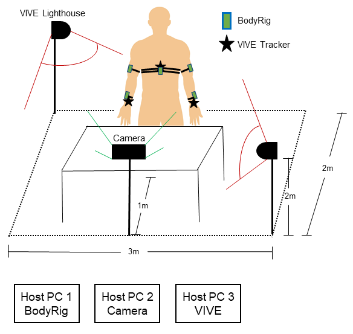
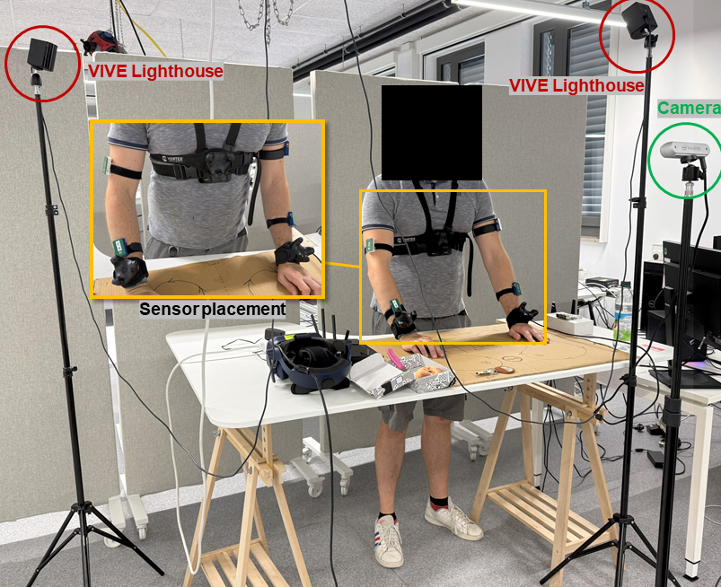
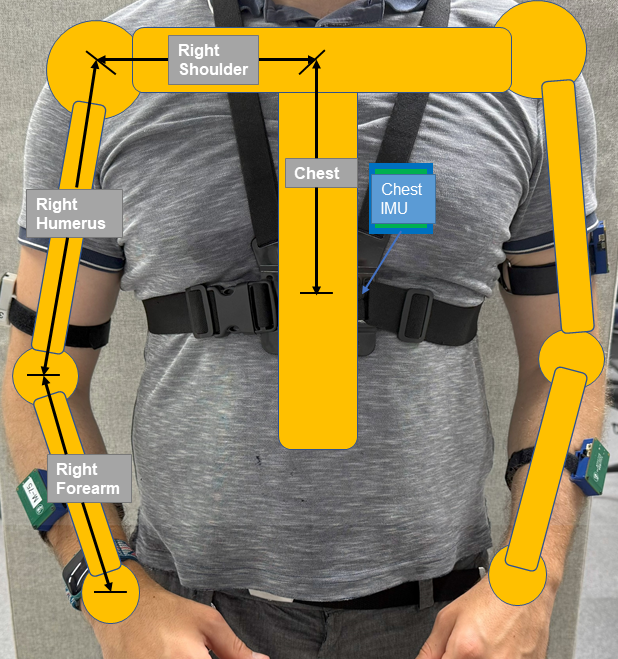
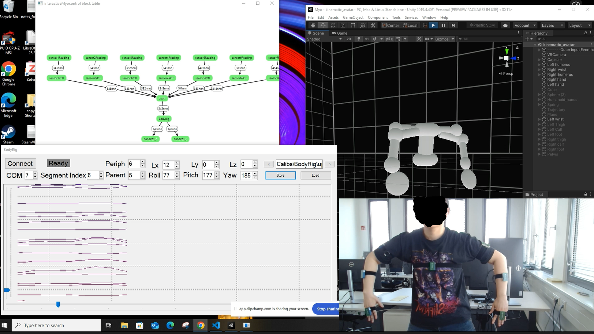
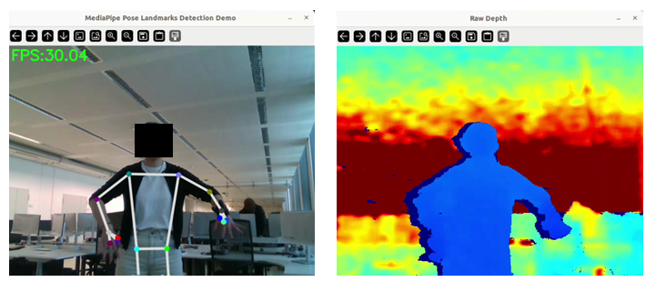
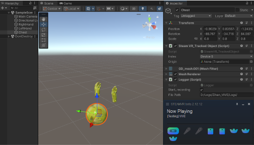
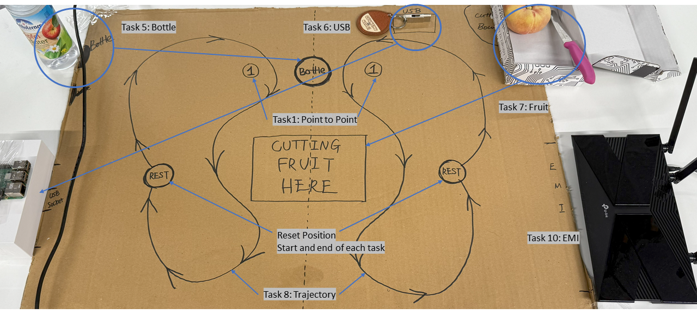
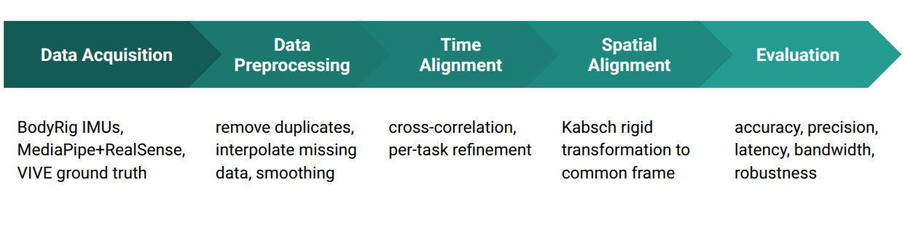
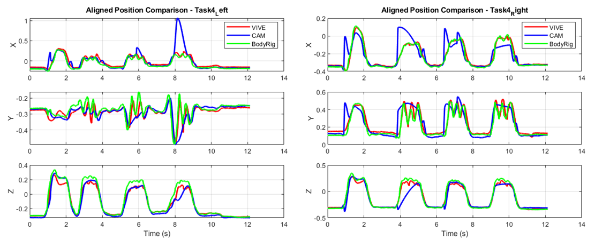
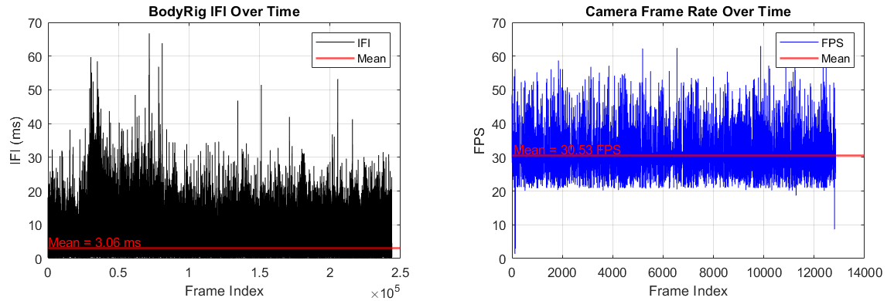

# Motion Tracking Benchmark for Wearable and Vision Systems

A full-system validation framework for multi-sensor motion tracking, including synchronized acquisition, spatial alignment, automated evaluation, and stress testing.

---

## Engineering Scope

- Designed and owned a full validation lifecycle including test specification, automated execution, regression comparison, and performance reporting.
- Defined quantitative acceptance criteria for multi-sensor tracking accuracy and latency under stressed conditions.
- Built a reproducible benchmarking pipeline for cross-system performance evaluation.


---

## Overview

This project evaluates upper-body motion tracking using:

- IMU-based system (**BodyRig**)
- Vision-based system (**MediaPipe + RealSense**)
- Optical tracking (**HTC VIVE**) as ground truth

The goal is to evaluate how well low-cost tracking systems perform under realistic movement conditions.





---

## Systems Compared

### IMU-based system
BodyRig wearable tracking suit with 5 IMU sensors.



The IMUs provide real-time orientation data, which drives a Unity avatar for visualization.



### Vision-based system
MediaPipe Pose + Intel RealSense D455.



### Ground truth
HTC VIVE optical tracking system.



---


## Benchmark Design

- Participants (N=9) performed 10 standardized upper-body tasks derived from teleoperation use cases
- Balanced ecological realism and cross-system comparability
- Incorporated stress scenarios including visual occlusion and electromagnetic interference (EMI)





## Data Processing & Alignment



- Developed calibration and coordinate alignment procedures across heterogeneous sensing modalities
- Implemented cross-correlation based time synchronization
- Applied Kabsch rigid-body alignment for spatial registration
- Developed automated task segmentation and metric computation (Python + MATLAB)
- Built batch evaluation scripts for reproducible analysis


---

## Evaluation Metrics

The benchmark focuses on four performance dimensions:

- **Accuracy**: 3D wrist position error compared to VIVE ground truth, measured with MAE and RMSE
- **Precision**: trial-to-trial repeatability across repeated motions
- **Latency**: delay between real movement and system output
- **Bandwidth**: sampling rate stability and temporal jitter

---


## Code Structure

```text
acquisition/
  camera_recording.py        # RGB-D data collection with MediaPipe + RealSense

src/
  preprocessing/
    align_sources.m          # global and local time alignment
    process_task_segment.m   # task-wise segmentation

  alignment/
    Kabsch.m                 # spatial alignment to reference frame

  pipeline/
    run_pipeline.m           # loads raw data and performs alignment

  evaluation/
    evaluate_accuracy.m      # computes MAE / RMSE
    evaluate_precision.m     # computes repeatability metrics


``` 

## Example Results

Example outputs include:

- 3D trajectory comparison across systems  



- Time-series tracking plots  
- Accuracy comparison across tasks  
- Frame rate stability plots  




## Key Contributions

- Designed and owned the complete benchmarking architecture
- Led multi-sensor integration and experimental execution
- Developed automated validation and regression evaluation framework
- Delivered quantitative performance insights for wearable and vision-based tracking systems


## Notes

The original dataset and full experimental code are not publicly available due to collaboration agreements with the research lab and industry partner.  

Example scripts and documentation are provided to illustrate the benchmarking pipeline.


